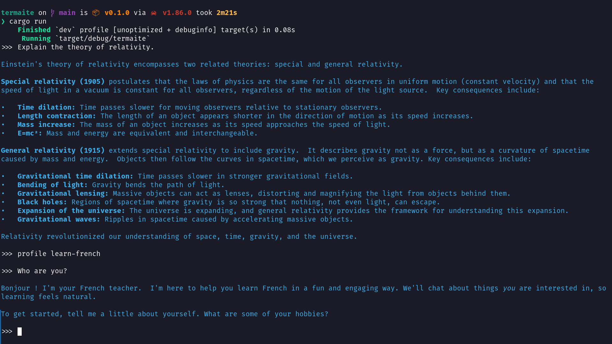
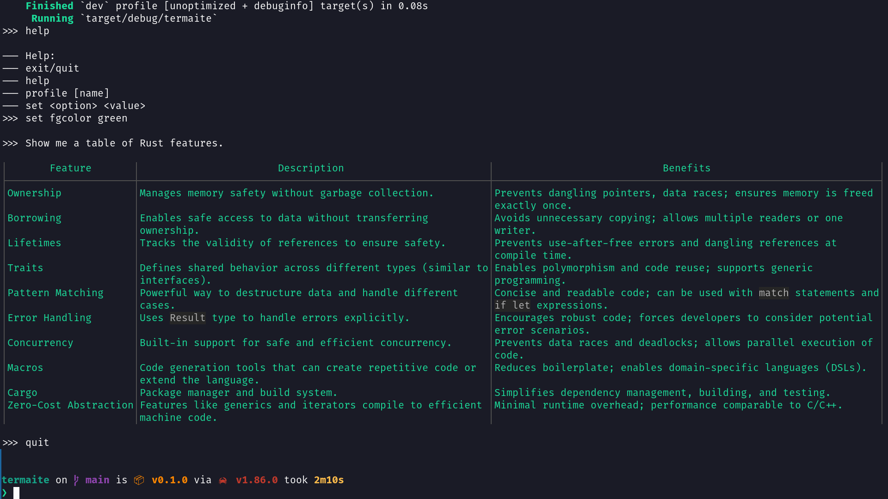

# Termaite

Simple AI client for the terminal.

`Termaite` allows you to efficiently ask questions or give instructions to a LLM without leaving the terminal using a CLI that behaves like a shell, prompting you in a loop and providing the answers you seek.

# Features

* Chat history
* Multiple profiles
* Markdown rendering
* Easy configuration
* Powered by Gemini

## Screenshots

